# Photon Mapping

#### What is Photon Mapping?

Photon mapping is a two-pass global illumination algorithm developed by Henrik Wann Jensen that approximately solves the rendering equation. Rays from the light source and rays from the camera are traced independently until some termination criterion is met, then they are connected in a second step to produce a radiance value.

Here's a [good introduction](https://web.cs.wpi.edu/~emmanuel/courses/cs563/write_ups/zackw/photon_mapping/PhotonMapping.html).

Screenshots
-----------

#### Results (11 million photons)

<table class="image">
<tr>
	<td>Pre-pass</td>
	<td>Second-pass</td>
</tr>
<tr>
	<td>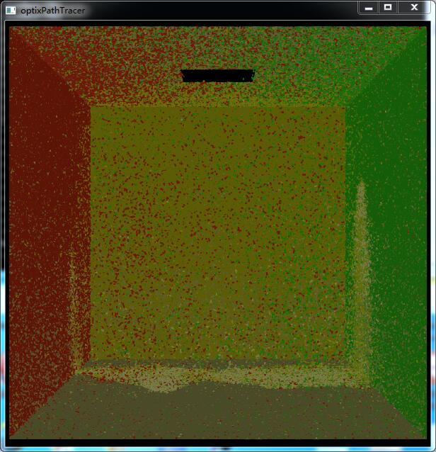</td>
	<td>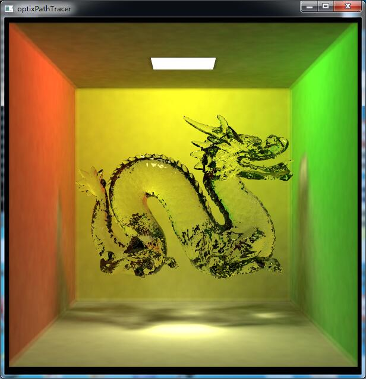</td>
</tr>
<tr>
	<td>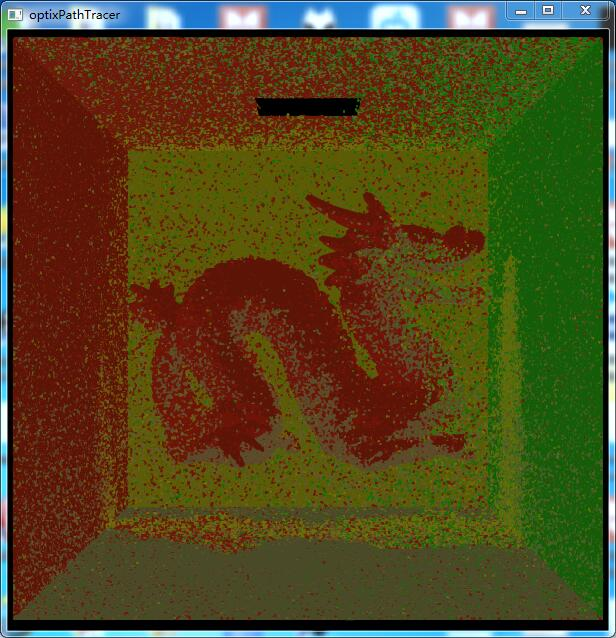</td>
	<td>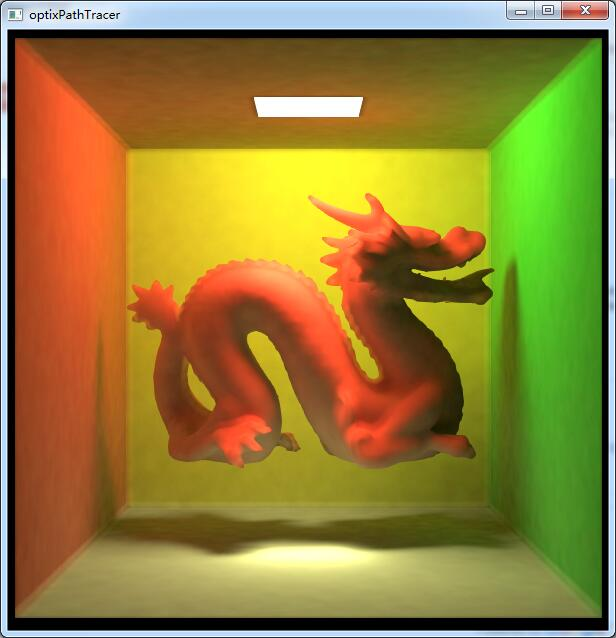</td>
</tr>
<tr>
	<td>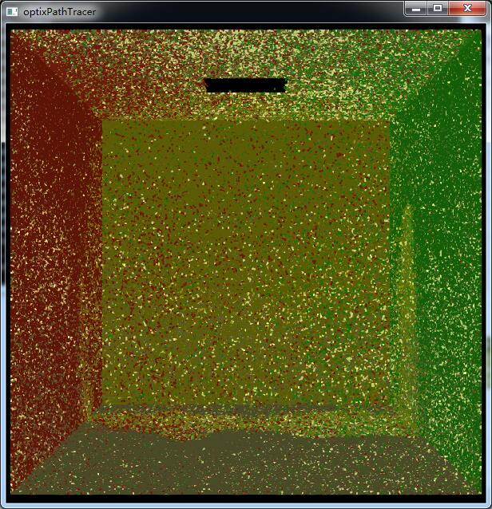</td>
	<td>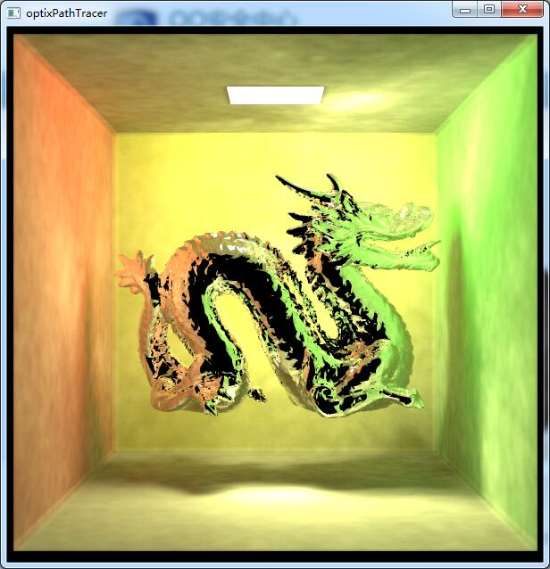</td>
</tr>
</table>

#### Photon Visualization

The shadow looks not correct enough because in this image, we shoot photons only from one corner of our parallelogram light. We also visualize the bounding box of our objects.

Photons are experiencing z-flipping because there're too many photons and if the camera isn't close enough, lots of them are overlapped.

<table class="image">
<tr>
	<td>Original image</td>
	<td>Photons</td>
</tr>
<tr>
	<td>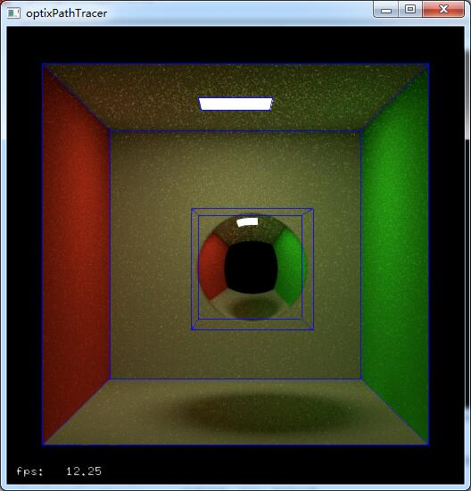</td>
	<td></td>
</tr>
</table>

#### Photon Probability

For the bidirectional photon mapping, we calculate the probability of our photons in the pre-pass and store them in the buffer in order to use them in the second-pass.

#### Different Searching Radius

Radius is an important parameter to adjust in photon mapping. In the second-pass, we shoot rays from the camera and get the hit-points. For each hit-point, we determine which photons are within the radius. Then we simply average the color of the photons, or using some weighting strategies (we weight them by the probability of the path in bidirection photon mapping), to get the color of the hit-point.

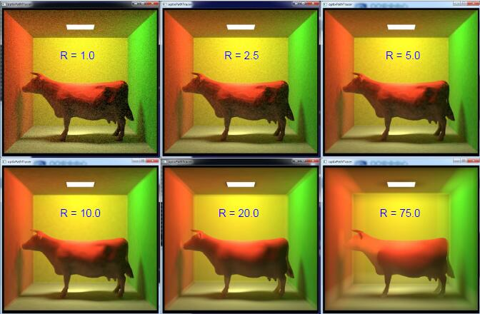

#### Different Amount of Photons

Photon mapping is a biased estimator. Increase the number of photons can significantly reduce the error of this estimator. But photon mapping is consistent, which means it can still get a totally correct result. Consider we shoot infinite photons into the scene and reduce the radius to an infinitesimal amount, which means the hit-point exactly hit the photons and you don't need to average anything which introduces bias into the radiance of the hit-point.

As you can see, more photons lead to a more correct result.

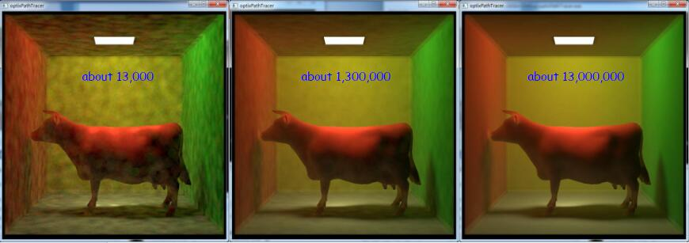

#### Uniform Hash Grid

We use hash grid to store our photons, which is an efficient data structures when you're search the near photons for the hit-points. In our algorithm, we set the radius to half of the grid width. By doing this, we only need to check 8 grids in each search.

 KD-tree is a more efficient solution, but it's much more difficult to implement due to lots of GPU memory managements. However, KD-tree is quite a good solution for point sets.

We didn't intend to visualize the hash grids. Luckily, if we increase the radius but remain the grid width, we get the following image, which visualize the grids on the walls. It's caused by the hit-points near the center of the grids, which miss lots of photons outside their 8 grids.

### Analysis

Time cost in the pre-pass: (Using Russian-Roulette to terminate the rays randomly, you can see the life time of the rays with high variance)

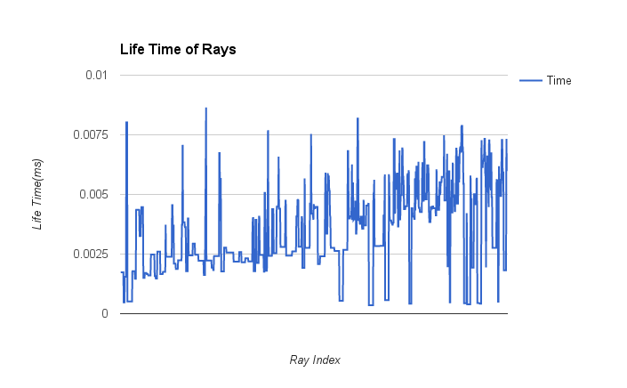

Time cost in the second-pass: (cornell box scene with diffuse walls and a specular shpere in the middle, which means most of rays bounce only once except for the rays hitting specular material)

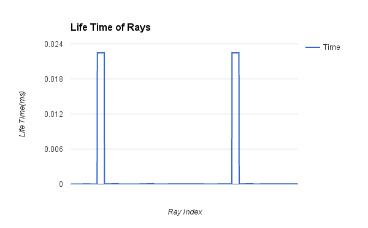

Time cost in the second-pass: (cornell box scene with diffuse walls and a glass cow in the middle, which means rays hitting the cow take more time)

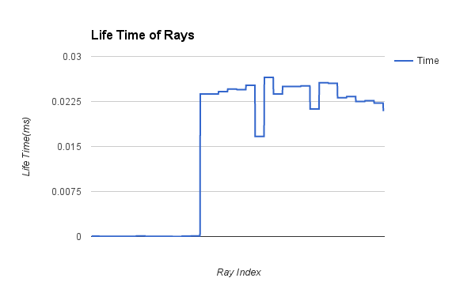